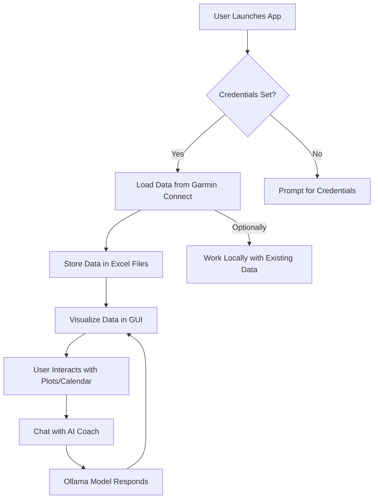

# Activity Tracker

A Python desktop tool for analyzing and visualizing running activities using Garmin Connect data and AI-powered insights.

---

## Features

- Sync and analyze your Garmin running data
- Visualize metrics, splits, and training load (TSS, CTL, ATL)
- Chat with an AI coach (Ollama integration)
- Modern, user-friendly PyQt5 interface

---

## Data Flow



---

## Data Storage

- **Summary data:** `activity_tracker/data/garminSummaryData.xlsx`
- **Lap/split data:** `activity_tracker/data/garminSplitData.xlsx`

---

## Usage

1. **Set environment variables:**
    - `GARMIN_USERNAME` and `GARMIN_PASSWORD`
    - Optionally, `GARMIN_USE_API=0` to work locally without downloading new data
2. **Run the application:**
    - `python main_window.py` (or use your launcher script)
3. **Sync and visualize your data**
4. **Chat with the AI coach** for personalized insights

---

## Requirements

- Python 3.8+
- PyQt5
- matplotlib
- pandas
- numpy
- [Ollama](https://ollama.com/) (for AI chat, optional)

Install dependencies:
```sh
pip install -r requirements.txt
```

---

## AI Coach (Ollama Integration)

- Make sure the Ollama server is running and at least one model is available.
- Select your preferred model in the app.
- Ask questions or get training advice from the AI coach.

---

## Contributing

Pull requests and suggestions are welcome!

---

## License

MIT License

---

*Happy tracking!*