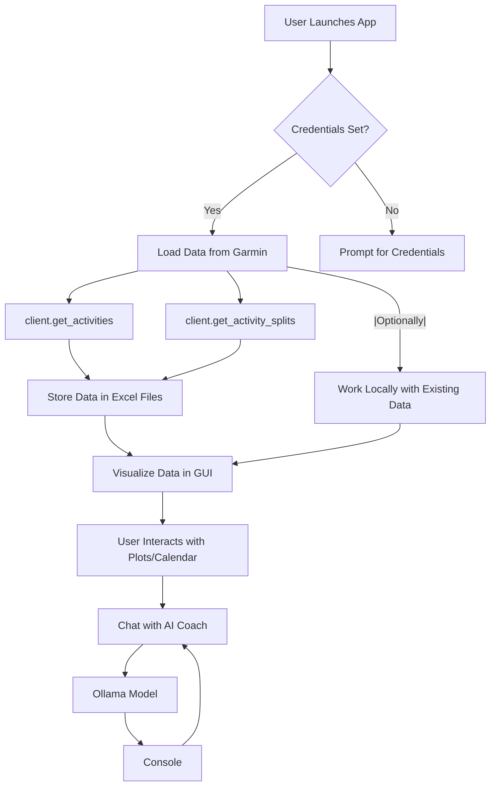

## Author

Ryan Kari
ryan.j.kari@gmail.com

https://github.com/ryankari

# Activity Tracker

A Python desktop tool for analyzing and visualizing running activities using Garmin Connect data and AI-powered insights.

---

## Features

- Sync and analyze your Garmin running data
- Visualize metrics, splits, and training load (TSS, CTL, ATL)
- Chat with an AI coach (Ollama integration, streaming supported)
- Modern, user-friendly PyQt5 interface
- Modular codebase with clear separation of logic, plotting, AI, and styles

---

## Motivation

To provide athletes and endurance enthusiasts with a means of tracking our data and fitness over the long term.
While focused on Garmin, the intention is to retrieve data, store it locally, and provide an agnostic means of tracking and analyzing our data. 

## Data Flow



---

## Data Storage
Files created if don't already exist
- **Summary data:** `data/garminSummaryData.xlsx`
- **Lap/split data:** `data/garminSplitData.xlsx`

---

## Usage

1. **Set environment variables:**
    - `GARMIN_USERNAME` and `GARMIN_PASSWORD`
    - Optionally, `GARMIN_USE_API=0` to work locally without downloading new data
2. **Install dependencies:**
    ```sh
    pip install -r requirements.txt
    ```
3. **Install Ollama and download model**
Tested with:
- tinyllama
- Mistral
4. **Run the application:**
    - From the project root:
      ```sh
      python main.py
      ```
5. **Sync and visualize your data**
6. **Chat with the AI coach** for personalized insights

---

## Requirements

- Python 3.8+
- PyQt5
- matplotlib
- pandas
- numpy
- [Jinja2](https://palletsprojects.com/p/jinja/) (for prompt templating)
- [Ollama](https://ollama.com/) (for AI chat, optional)

---

## AI Coach (Ollama Integration)

- Make sure the Ollama server is running and at least one model is available.
- Select your preferred model in the app.
- Ask questions or get training advice from the AI coach.
- AI responses are streamed to the console for a live chat experience.

---

## Development & Testing

- All code is organized in the `garmin_activity_tracker/` package.
- Tests are in the `tests/` directory and can be run with:
    ```sh
    pytest
    ```
- Code formatting is enforced with [Black](https://black.readthedocs.io/en/stable/):
    ```sh
    pip install black
    ```

---

## Contributing

Pull requests and suggestions are welcome!

---

## License

MIT License

---